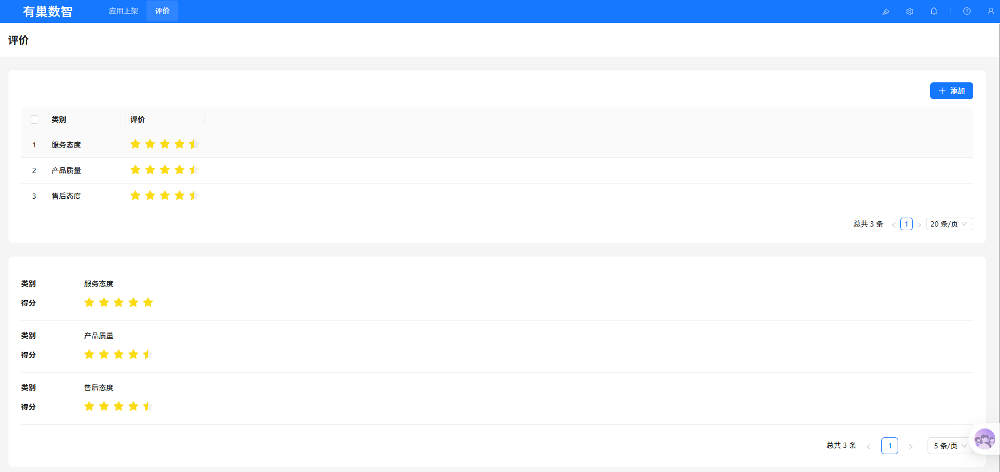

# @youchaoyun/plugin-rating — Documentation

> @youchaoyun/plugin-rating Star Rating Plugin — provides an intuitive 5-star rating component for both data tables and forms.

---

## ✨ How It Looks

### Table View — Click Stars to Rate Instantly

In list/table views, rating fields are displayed as interactive stars. Users can rate **directly in the table** without opening a detail page. Click a star and the rating is saved to the database in real time.

**Key Highlights:**
- ⚡ **Instant Interaction** — Click a star and it's saved. No popups, no redirects.
- 🎯 **Half-Star Precision** — Supports 0.5-star increments for more granular ratings.
- 🔄 **Auto-Sync** — Changes are written to the database immediately and reflected across all views.

### Form View — Visual Rating Selection

In create/edit forms, rating fields appear as intuitive star components — far more user-friendly than numeric input fields.

**Key Highlights:**
- 👆 **WYSIWYG** — Hover to preview the score before clicking.
- 🎨 **Consistent Experience** — Unified interaction style between table view and form view.
- 📱 **Responsive** — Looks great on any screen size.

---

## 📖 Features

| Feature | Description |
|---------|-------------|
| Max rating | 5 stars (extensible) |
| Half-star support | ✅ 0.5-star precision |
| Inline table rating | ✅ Click stars in table to update database directly |
| Form rating component | ✅ Visual star selector in forms |
| Filter support | ✅ Usable as a filter condition |
| Data type required | integer / number |

---

## 🛠 How to Use

### Step 1: Create a Rating Field

Add a numeric field (Integer or Number) to store the rating value in your target collection.

1. Go to **System Settings → Collections**
2. Select your target table, click "Add field"
3. Choose field type **Integer** or **Number**
4. Use a semantic name like `rating`, `score`, or `rate`
5. Save the field

### Step 2: Configure the Display Component

After creating the field, configure it to use the rating component in the UI.

#### Table View — Clickable Star Rating

1. Open the table page containing the rating field
2. Click "UI Configuration" at the top to enter edit mode
3. Find the rating column, click the gear icon ⚙️ on the column header
4. In the settings panel, set "Field Component" to **Rating stars**
5. Save the configuration

#### Form View — Rating Selector

1. Open a create/edit form (click "Add" or edit an existing record)
2. Click "UI Configuration" at the top to enter edit mode
3. Find the rating field, click the gear icon ⚙️ on the field
4. Set "Field Component" to **Rating**
5. Save the configuration

### Step 3: Start Rating

Once configured:

- **Table view** — Hover and click stars to rate. Save is immediate.
- **Form view** — Click stars to select a rating, then submit the form as usual.

---

## 💡 Best Practices

### Great Use Cases

- Customer service evaluations (attitude, professionalism, response speed)
- Product ratings (ease of use, completeness, value for money)
- Content recommendation ranking (weight by user rating)
- Employee performance reviews (multi-dimensional scoring)

### Naming Recommendations

| Field Name | Purpose | Recommended Type |
|------------|---------|------------------|
| rating / score | Overall rating | Integer (1-5) |
| quality | Product quality | Integer (1-5) |
| attitude | Service attitude | Integer (1-5) |
| satisfaction | Satisfaction score | Number (0-5, half-star) |

### Integration with Workflows

Rating fields work seamlessly with the NocoBase Workflow Engine:
- Auto-trigger notifications when ratings fall below a threshold
- Auto-update category tags based on average ratings
- Build weekly/monthly rating trend reports

---

## 📝 Changelog

### v2.0.8

- Half-star rating support (allowHalf)
- Inline table rating
- Form rating component
- Filter support

---

## 📄 License

This project is licensed under the AGPL-3.0 license.
