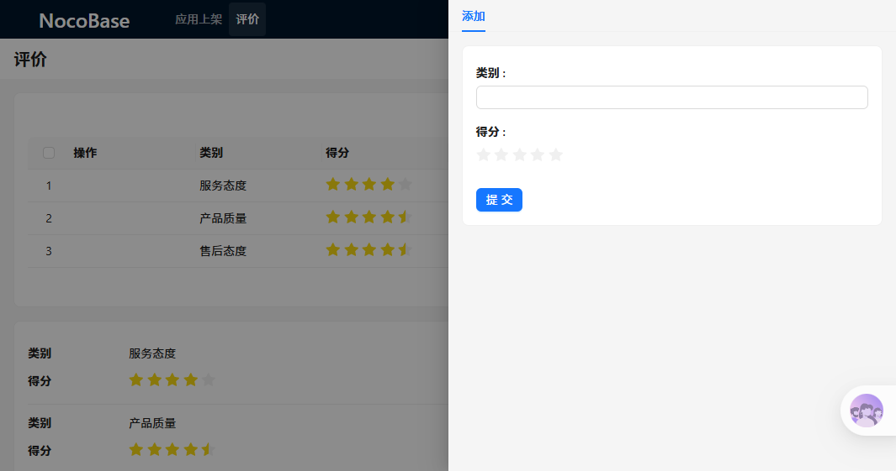

# @youchaoyun/plugin-rating — 使用文档

> NocoBase 星级评分插件，为数据列表和表单提供直观的五星评分交互组件。

---

## ✨ 使用效果

### 列表页 — 点击星星即时评分

在列表视图中，评分字段以可交互的星星展示。用户**无需进入详情页**，直接点击星星即可完成评分，数据实时保存到数据库。

**核心亮点：**
- ⚡ **即时交互** — 点击星星立即生效，无弹窗、无跳转
- 🎯 **半星支持** — 精度可达 0.5 星，评分更细腻
- 🔄 **自动同步** — 评分结果实时写入数据库，页面自动更新

### 表单页 — 可视化评分选择

在新建 / 编辑表单中，评分字段以直观的星星组件呈现，比数字输入框更易用、更美观。

**核心亮点：**
- 👆 **所见即所得** — 鼠标悬停即可预览分数
- 🎨 **一致体验** — 列表页与表单页交互风格统一
- 📱 **响应式布局** — 在不同屏幕尺寸下均保持良好展示

---

## 📖 功能特性

| 特性 | 说明 |
|------|------|
| 最大评分数 | 5 星（可扩展） |
| 半星精度 | ✅ 支持 0.5 星评分 |
| 列表页即时评分 | ✅ 点击星星直接更新数据库 |
| 表单页评分组件 | ✅ 可视化评分选择 |
| 筛选器支持 | ✅ 可作为筛选条件 |
| 数据类型要求 | integer / number |

---

## 🛠 如何使用

### 第一步：创建评分字段

在你的数据集合中创建一个数字类型字段（Integer 或 Number），用于存储评分值。

1. 进入 **系统设置 → 数据模型**
2. 选择目标数据表，点击「添加字段」
3. 字段类型选择 **整数（Integer）** 或 **数字（Number）**
4. 字段名称建议使用 `rating`、`score`、`rate` 等语义化名称
5. 保存字段配置

### 第二步：配置视图展示方式

创建好字段后，你需要在界面配置中将该字段设置为评分组件展示。

#### 列表视图 — 设置为可点击的星级评分

1. 打开包含评分字段的数据表列表页
2. 点击顶部「界面配置」进入编辑模式
3. 找到评分字段的列，点击列头的设置图标 ⚙️
4. 在弹出的配置面板中，将「字段组件」设置为 **星级评分（Rating stars）**
5. 保存配置

#### 表单视图 — 设置为评分选择器

1. 打开新建 / 编辑表单（可通过「添加」按钮进入）
2. 点击顶部「界面配置」进入编辑模式
3. 找到评分字段，点击字段右上角的设置图标 ⚙️
4. 将「字段组件」设置为 **评分（Rating）**
5. 保存配置

### 第三步：开始使用

配置完成后：

- **列表页** — 直接点击星星即可评分，鼠标悬停预览，点击即保存
- **表单页** — 点击星星选择评分，随表单一起提交

---

## 💡 最佳实践

### 适合评分插件的场景

- 客户服务评价（服务态度、专业水平、响应速度）
- 产品评分（易用性、功能完整性、性价比）
- 内容推荐排序（根据用户评分加权计算）
- 员工绩效考核（多维度打分）

### 字段命名建议

| 字段名称 | 用途 | 推荐类型 |
|----------|------|----------|
| rating / score | 综合评分 | Integer（1-5）|
| quality | 产品质量评分 | Integer（1-5）|
| attitude | 服务态度评分 | Integer（1-5）|
| satisfaction | 满意度评分 | Number（0-5，支持半星）|

### 与工作流结合

评分字段可与 NocoBase 工作流引擎联动：
- 当评分低于某阈值时自动触发通知
- 根据平均评分自动更新分类标签
- 统计每周 / 每月评分趋势报表

---

## 📝 更新日志

### v2.0.8

- 支持半星评分（allowHalf）
- 列表页即时评分功能
- 表单页评分组件
- 筛选器评分支持

---

## 📄 许可证

本项目基于 AGPL-3.0 许可证开源。
